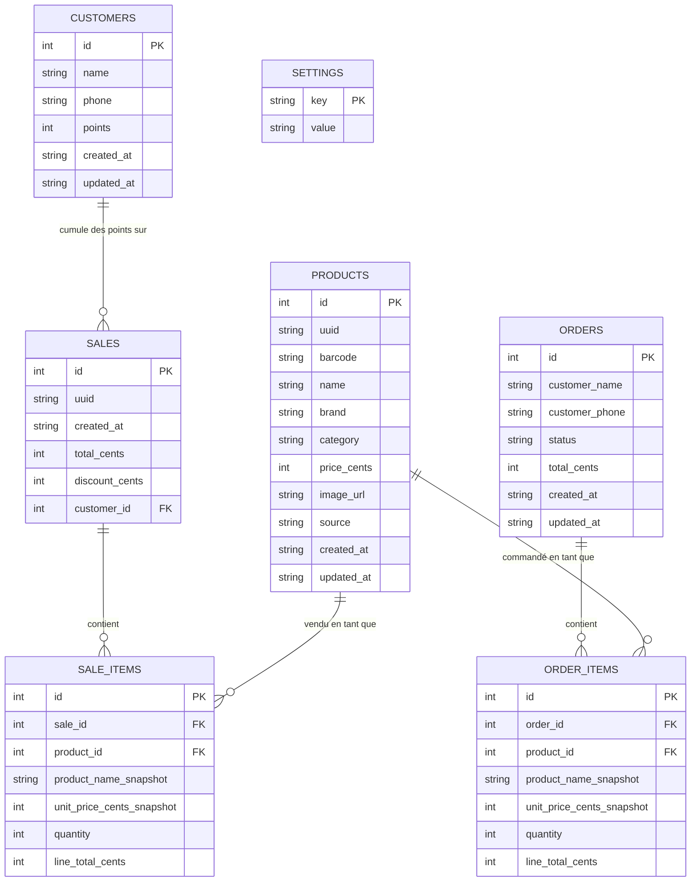
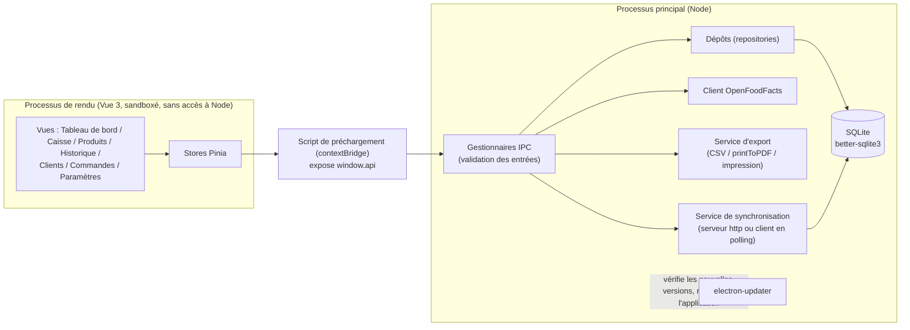

# Dossier de conception — Grocery POS

## Contexte

Une épicerie de quartier fonctionne aujourd'hui avec des registres papier et une vieille caisse enregistreuse. La propriétaire a besoin d'une application de bureau simple, capable de fonctionner hors ligne, qu'une personne non technique puisse installer et utiliser de façon fiable sur le PC de la caisse. Ce document couvre le modèle de données, l'architecture, et la justification des choix techniques laissés ouverts par le cahier des charges.

## Modèle de données

- **Les prix sont stockés en centimes entiers**, pas en nombres à virgule flottante, pour éviter les erreurs d'arrondi dans les totaux.
- **`sale_items` conserve une copie figée (snapshot) du nom et du prix du produit au moment de la vente.** Si le prix ou le nom d'un produit change ensuite, les reçus passés et l'historique des ventes doivent toujours refléter ce que le client a réellement payé — c'est l'endroit où la justesse compte le plus, donc la jointure est volontairement dénormalisée. `order_items` fait de même pour les commandes.
- **`settings` est une simple table clé/valeur** pour le thème, la langue et la configuration de synchronisation, plutôt qu'un second mécanisme de persistance (par exemple `electron-store`) en plus de SQLite. Une seule source de vérité pour l'état local.
- **`products.source`** (`manual` | `openfoodfacts`) indique comment un produit est entré dans le catalogue, ce qui pilote les deux parcours distincts exigés par le besoin client autour des codes-barres.
- **`products.uuid` / `sales.uuid`** sont des identifiants de synchronisation globalement uniques, distincts de l'`id` auto-incrémenté local. Deux bases de données alimentées indépendamment ne peuvent pas partager leurs `id` auto-incrémentés ; la synchronisation multi-poste (voir plus bas) fait donc correspondre les lignes par `uuid`. Les bases existantes sont migrées en ajoutant la colonne puis en la remplissant ; les nouvelles lignes en reçoivent un dès l'insertion (`lower(hex(randomblob(16)))`).
- **`sales.customer_id` / `sales.discount_cents`** soutiennent le programme de fidélité : une vente peut être liée à une ligne `customers` et enregistrer une remise en points appliquée. `customers.phone` est la clé de recherche en caisse ; `orders.customer_name`/`customer_phone` sont volontairement du texte libre, découplés de `customers` — une commande téléphonique ou à livrer ne provient pas forcément d'un client inscrit au programme de fidélité.

## Architecture

- **Frontière entre processus :** `contextIsolation: true`, `nodeIntegration: false`, `sandbox: true`. Le processus de rendu ne touche jamais Node ni la base de données directement — uniquement via `window.api`, exposé par le script de préchargement grâce à `contextBridge`. Les noms de canaux et les types de requête/réponse sont définis une seule fois dans `src/shared/ipc-contract.ts` et importés par le processus principal, le préchargement et le rendu, afin que les trois côtés ne puissent pas diverger.
- **La validation se fait dans le processus principal**, à la frontière IPC (par exemple, le prix doit être un entier positif, une vente nécessite au moins un article) — le processus de rendu est traité comme une source non fiable, conformément aux recommandations de sécurité d'Electron.
- **Les dépôts (repositories) sont des fonctions fabriques** (`createProductsRepository(db)`, etc.) qui prennent une instance `Database` de `better-sqlite3` plutôt qu'un singleton au niveau du module. C'est ce qui permet à la suite de tests d'exécuter exactement la même logique contre une base `:memory:`, sans mock.
- **Le service de synchronisation est volontairement séparé des dépôts CRUD.** `syncRepository.ts` lit et écrit les lignes brutes par `uuid` directement, plutôt que de passer par `productsRepository`/`salesRepository`, car la forme des lignes de synchronisation (plate, indexée par `uuid`, sans `id` local) correspond à un contrat différent des besoins CRUD propres à l'application.

## Choix clés

| Décision                                                                                                                                          | Pourquoi                                                                                                                                                                                                                                                                                            |
| --------------------------------------------------------------------------------------------------------------------------------------------------- | ----------------------------------------------------------------------------------------------------------------------------------------------------------------------------------------------------------------------------------------------------------------------------------------------------- |
| SQLite (`better-sqlite3`) plutôt qu'un fichier JSON                                                                                                | Requêtes relationnelles (historique des ventes, jointures) et écritures transactionnelles ; un fichier JSON risque la corruption en cas de plantage en cours d'écriture — et la cliente veut explicitement une application qui « ne plante pas ».                                                  |
| Vue 3 + Pinia plutôt que React/Redux                                                                                                                | Le cahier des charges n'imposait aucun framework ; l'empreinte plus légère de Vue et sa réactivité intégrée conviennent à une interface de caisse riche en formulaires et tableaux, sans plomberie supplémentaire.                                                                                  |
| Routage par hachage (`vue-router` + `createWebHashHistory`)                                                                                         | L'application packagée charge `index.html` via `file://`, où le mode historique HTML5 ne fonctionne pas sans serveur.                                                                                                                                                                              |
| Reçus PDF via `webContents.printToPDF`                                                                                                              | Démontre une capacité native d'Electron plutôt que de recourir à une bibliothèque PDF, ce qui répond directement au critère d'évaluation « exploitation d'Electron ».                                                                                                                              |
| Saisie du code-barres via un simple champ texte (douchette USB en mode clavier)                                                                     | Les vraies douchettes USB tapent des chiffres + Entrée comme un clavier. Cela ne demande aucune bibliothèque supplémentaire et correspond au besoin client « sans technicien » ; la lecture par webcam ajouterait une gestion des permissions caméra et une bibliothèque de décodage pour peu de bénéfice réel ici. |
| `better-sqlite3` recompilé selon l'environnement d'exécution (scripts npm `pretest`/`posttest`, `predev`/`prestart`, `prebuild:win`/`prebuild:unpack`) | L'ABI du module natif doit correspondre au Node qui le charge : le Node embarqué d'Electron pour l'application, le Node du système pour Vitest. Chaque point d'entrée qui a besoin du build Electron le recompile d'abord, afin que l'application se rétablisse même si un `npm test` précédent a été interrompu avant son `posttest` — voir [README.md](./README.md#tests). |
| Import en masse du catalogue par lots de 200 lignes, avec une pause via `setImmediate` entre chaque lot                                            | Évite qu'un gros fichier CSV ne gèle l'interface, sans introduire d'architecture à base de worker thread pour une application de bureau mono-utilisateur.                                                                                                                                          |
| Calcul de fidélité volontairement simple : 1 point par €1 du total après remise, échange par multiples de 100 points = 1€ de remise                | Facile à expliquer par la caissière à un client en caisse ; la remise est plafonnée au sous-total de la vente, pour qu'un échange de points ne puisse jamais rendre une vente négative.                                                                                                            |
| Sauvegarde via `db.backup()` de better-sqlite3 plutôt qu'une simple copie de fichier                                                                | `db.backup()` est l'API de sauvegarde « à chaud » propre à SQLite — sûre à exécuter pendant que la base de données est ouverte et en cours d'écriture, contrairement à une copie directe du fichier `.sqlite3` qui pourrait capturer une page à moitié écrite.                                     |
| Mise à jour automatique branchée sur le fournisseur `github` d'`electron-builder`, publiée par une GitHub Action                                   | `electron-updater` lit le `latest.yml` généré par `electron-builder` sur les Releases GitHub du dépôt ; `.github/workflows/release.yml` construit et publie l'installeur (`electron-builder --win --publish always`) à chaque tag `vX.Y.Z`, donc une vérification de mise à jour trouve une vraie version sans hébergement séparé à maintenir. |
| Synchronisation multi-poste limitée aux tables `products` et `sales`, mise en correspondance par une colonne `uuid` avec la règle « dernière écriture gagne » sur `updated_at` | Le besoin formulé est « deux caisses voient les mêmes produits et les mêmes ventes » — pas un système de réplication généraliste. `uuid` existe car les `id` auto-incrémentés de deux bases alimentées indépendamment entrent en collision ; les lignes `sales` sont en insertion seule côté récepteur puisqu'une vente terminée n'est jamais modifiée. |

## Comportement hors ligne par défaut

Toutes les opérations essentielles (caisse, gestion des produits, historique des ventes) ne touchent jamais que la base SQLite locale — aucune fonctionnalité requise par le client ne dépend du réseau. La recherche de code-barres OpenFoodFacts est conçue pour échouer sans danger : une erreur réseau, un délai dépassé ou une réponse « introuvable » retombent tous sur le même formulaire de saisie manuelle, et la caissière en est informée par une notification système plutôt que par une erreur bloquante. Le processus de rendu affiche aussi un indicateur en direct de connexion (`navigator.onLine` + événements `online`/`offline`), à titre purement informatif.

Deux ajouts plus récents effectuent aussi des appels réseau, tous deux désactivés par défaut et activables volontairement : la vérification de mise à jour automatique (vers l'URL de publication `electron-builder`) et la synchronisation multi-poste en mode client (requêtes HTTP sur le réseau local vers l'hôte configuré). Aucun des deux ne s'exécute sans activation explicite, donc la garantie de fonctionnement hors ligne au quotidien reste valable.

## Sécurité

- Processus de rendu sandboxé, à contexte isolé, sans intégration Node.
- La `Content-Security-Policy` limite les scripts/styles à `'self'` et les images à `'self'`, `data:`, et au CDN d'images d'OpenFoodFacts.
- Toutes les entrées IPC sont validées côté serveur (processus principal) avant d'atteindre la base de données.
- `window.confirm` est utilisé pour les actions destructrices (suppression d'un produit) — un choix volontairement simple pour une caisse à opérateur unique ; une fenêtre modale personnalisée ajouterait de la complexité sans véritable gain de sécurité à cette échelle.

## Limites de périmètre connues

Les neuf exigences essentielles du client ainsi que les huit modules avancés optionnels du cahier des charges sont désormais tous implémentés : import en masse du catalogue, programme de fidélité client, tableau de bord analytique, suivi de livraison des commandes, reçus imprimables (en plus de l'export PDF), sauvegarde/restauration, mises à jour automatiques, et synchronisation multi-poste.

Deux de ces modules ne peuvent pas être entièrement validés depuis une seule machine sans infrastructure externe ; ils sont documentés ici plutôt que signalés à nouveau comme manquants :

- **Les mises à jour automatiques** sont branchées de bout en bout sur une configuration réelle `electron-updater` + `electron-builder` (`publish: github`), publiée par `.github/workflows/release.yml` sur chaque tag `vX.Y.Z`. La valider entièrement nécessite tout de même une première Release publiée et une version installée antérieure à celle-ci, pour qu'il y ait effectivement une mise à jour à détecter.
- **La synchronisation multi-poste** (Paramètres → Synchronisation multi-poste) est une implémentation réelle et fonctionnelle de type hôte/client sur réseau local (module `http` natif de Node, sans nouvelle dépendance d'exécution) — la valider de bout en bout nécessite deux instances actives sur le même réseau, par exemple deux installations sur des machines différentes, ou deux instances sur une même machine pointant chacune vers un dossier `userData` et un port différents.
