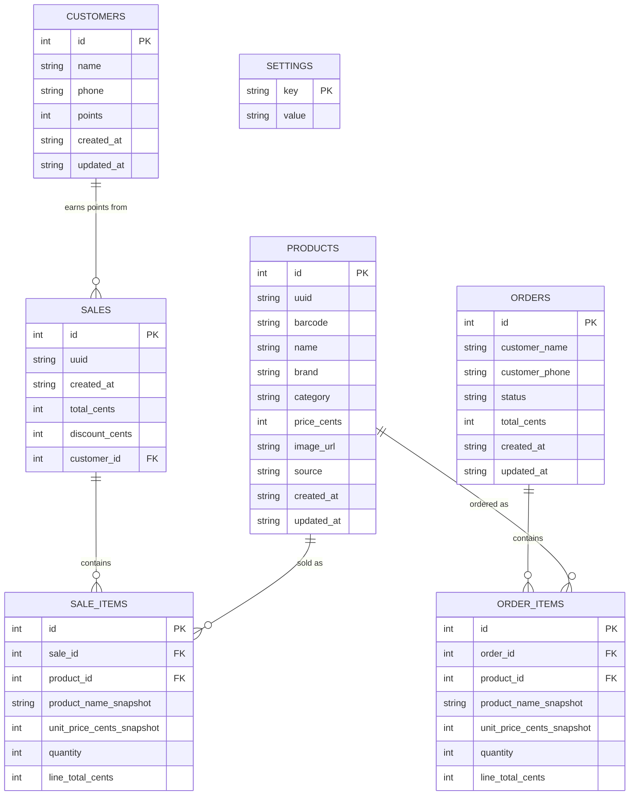
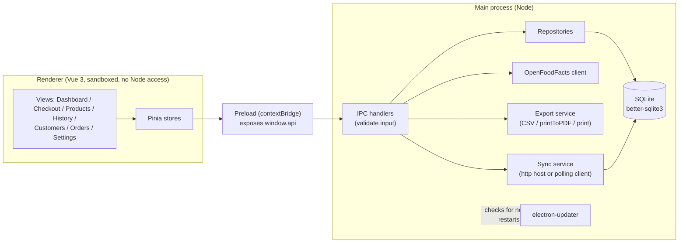

# Design Document — Grocery POS

## Context

A neighborhood grocery store currently runs on paper records and an old cash register. The owner needs a simple, offline-capable desktop application that a non-technical person can install and run reliably on the till PC. This document covers the data model, architecture, and the reasoning behind the technical choices left open by the brief.

## Data model

- **Prices are stored as integer cents**, not floats, to avoid rounding errors in totals.
- **`sale_items` snapshots the product name and price at the time of sale.** If a product's price or name changes later, past receipts and sales history must still reflect what the customer actually paid — this is the one place correctness matters most, so the join is deliberately denormalized. `order_items` does the same for orders.
- **`settings` is a single key/value table** for theme, language, and sync configuration, instead of a second persistence mechanism (e.g. `electron-store`) alongside SQLite. One source of truth for local state.
- **`products.source`** (`manual` | `openfoodfacts`) records how a product entered the catalog, which drives the two distinct workflows the client's barcode requirement calls for.
- **`products.uuid` / `sales.uuid`** are globally-unique sync identities, separate from the local autoincrement `id`. Two independently-seeded databases can't share autoincrement ids, so multi-station sync (below) matches rows by `uuid` instead. Existing on-disk databases are migrated by adding the column and backfilling it; new rows get one at insert time (`lower(hex(randomblob(16)))`).
- **`sales.customer_id` / `sales.discount_cents`** support the loyalty program: a sale optionally links to a `customers` row and records any points-based discount applied. `customers.phone` is the lookup key at checkout; `orders.customer_name`/`customer_phone` are deliberately plain text and decoupled from `customers` — a phone/delivery order isn't necessarily from an enrolled loyalty member.

## Architecture

- **Process boundary:** `contextIsolation: true`, `nodeIntegration: false`, `sandbox: true`. The renderer never touches Node or the database directly — only through `window.api`, exposed by the preload script via `contextBridge`. All channel names and request/response types are defined once in `src/shared/ipc-contract.ts` and imported by main, preload, and renderer, so the three sides cannot drift out of sync.
- **Validation lives in the main process**, at the IPC boundary (e.g. price must be a positive integer, a sale needs at least one item) — the renderer is treated as untrusted input, consistent with Electron's security guidance.
- **Repositories are factory functions** (`createProductsRepository(db)`, etc.) taking a `better-sqlite3` `Database` instance rather than a module-level singleton. This is what lets the test suite run the exact same logic against a `:memory:` database with no mocking.
- **The sync service is intentionally separate from the CRUD repositories.** `syncRepository.ts` reads/writes raw rows by `uuid` directly, rather than going through `productsRepository`/`salesRepository`, because the sync row shape (flat, `uuid`-keyed, no local `id`) is a different contract than the app's own CRUD needs.

## Key decisions

| Decision                                                                                                                       | Why                                                                                                                                                                                                                                                                                                                                 |
| ------------------------------------------------------------------------------------------------------------------------------ | ----------------------------------------------------------------------------------------------------------------------------------------------------------------------------------------------------------------------------------------------------------------------------------------------------------------------------------- |
| SQLite (`better-sqlite3`) over a JSON file store                                                                               | Relational queries (sales history, joins) and transactional writes; a JSON file risks corruption on a crash mid-write — and the client explicitly wants something that "doesn't crash."                                                                                                                                             |
| Vue 3 + Pinia over React/Redux                                                                                                 | The brief mandates no specific UI framework; Vue's smaller footprint and built-in reactivity fit a form-and-table-heavy POS UI without much extra plumbing.                                                                                                                                                                         |
| Hash-based routing (`vue-router` + `createWebHashHistory`)                                                                     | The packaged app loads `index.html` via `file://`, where HTML5 history mode doesn't work without a server.                                                                                                                                                                                                                          |
| PDF receipts via `webContents.printToPDF`                                                                                      | Demonstrates a native Electron capability rather than reaching for a PDF library, directly relevant to the "Electron exploitation" grading criterion.                                                                                                                                                                               |
| Barcode input via plain text field (USB scanner keyboard-wedge)                                                                | Real USB barcode scanners type digits + Enter like a keyboard. This needs zero extra libraries and matches the client's "no technician needed" requirement; webcam scanning would add camera permission and decoding-library complexity for no real gain in this context.                                                           |
| `better-sqlite3` rebuilt per runtime (`pretest`/`posttest`, `predev`/`prestart`, `prebuild:win`/`prebuild:unpack` npm scripts) | The native module's ABI must match whichever Node loads it: Electron's bundled Node for the app, the system Node for Vitest. Every entry point that needs the Electron build rebuilds it first, so the app self-heals even if a previous `npm test` was interrupted before its `posttest` ran — see [README.md](./README.md#tests). |
| Bulk catalog import in 200-row chunks, yielding via `setImmediate` between chunks                                              | Keeps a large CSV import from freezing the UI thread, without pulling in a worker-thread architecture for what's still a single-user desktop app.                                                                                                                                                                                  |
| Loyalty math kept simple: 1 point per €1 of the post-discount total, redemption in multiples of 100 points = €1 off            | Easy for a cashier to explain to a customer at the till; the discount is clamped to the sale's subtotal so a redemption can never make a sale go negative.                                                                                                                                                                          |
| Backup via better-sqlite3's `db.backup()` rather than a raw file copy                                                          | `db.backup()` is SQLite's own online-backup API — safe to run while the live database is open and being written to, unlike copying the `.sqlite3` file directly which could capture a half-written page.                                                                                                                          |
| Auto-update wired to a generic `electron-builder` provider with a placeholder URL                                              | Demonstrates the full `electron-updater` integration end-to-end (the code path is real and functional); a working install still needs the placeholder URL pointed at an actual static file host or GitHub Releases before it can serve real updates.                                                                              |
| Multi-station sync scoped to just `products` and `sales`, matched by a `uuid` column with last-write-wins on `updated_at`      | The literal requirement is "two terminals see the same products and sales" — not a general-purpose replication system. `uuid` exists because two independently-seeded databases' autoincrement `id`s collide; `sales` rows are insert-only on the receiving side since a completed sale is never edited.                          |

## Offline-first behavior

All core operations (checkout, product CRUD, sales history) only ever touch the local SQLite database — there is no network dependency for any of the client's required features. The OpenFoodFacts barcode lookup is designed to fail safely: a network error, timeout, or "not found" response all fall through to the same manual-entry form, and the cashier is notified via a system notification rather than a blocking error. The renderer also surfaces a live online/offline indicator (`navigator.onLine` + `online`/`offline` events) purely as a status cue.

Two later additions also make network calls, both opt-in and both off by default: the auto-update check (against the `electron-builder` publish URL) and multi-station sync in client mode (LAN HTTP requests to the configured host). Neither runs unless explicitly enabled, so the offline-first guarantee for day-to-day till operation still holds.

## Security

- Sandboxed, context-isolated renderer with no Node integration.
- `Content-Security-Policy` restricts script/style to `'self'` and images to `'self'`, `data:`, and the OpenFoodFacts image CDN.
- All IPC inputs are validated server-side (main process) before reaching the database.
- `window.confirm` is used for destructive actions (deleting a product) — a deliberately simple choice for a single-operator till; a custom modal would add UI complexity without a real safety benefit at this scale.

## Known scope boundaries

All nine core client requirements and all eight optional advanced modules from the brief are now implemented: bulk catalog import, the client loyalty program, dashboard analytics, the order delivery system, printable receipts (in addition to the PDF export), backup & restore, automatic updates, and multi-station sync.

Two of these can't be fully proven out from a single machine with no external infrastructure, and are documented here rather than re-flagged as missing:

- **Automatic updates** is wired up end-to-end against a real `electron-updater` + `electron-builder` `publish: generic` configuration, but the URL in `electron-builder.yml` is a placeholder (`https://updates.example.com/grocery-pos`). It needs to point at a real static file host (or swap to a provider like GitHub Releases) serving a built release plus its generated `latest.yml` before an update check can find anything.
- **Multi-station sync** (Settings → Multi-station sync) is a real, working LAN host/client implementation (Node's built-in `http`, no new runtime dependency) — proving it end-to-end requires two running instances on the same network, e.g. two installs on different machines, or two instances on one machine each pointed at a different `userData` directory and port.
