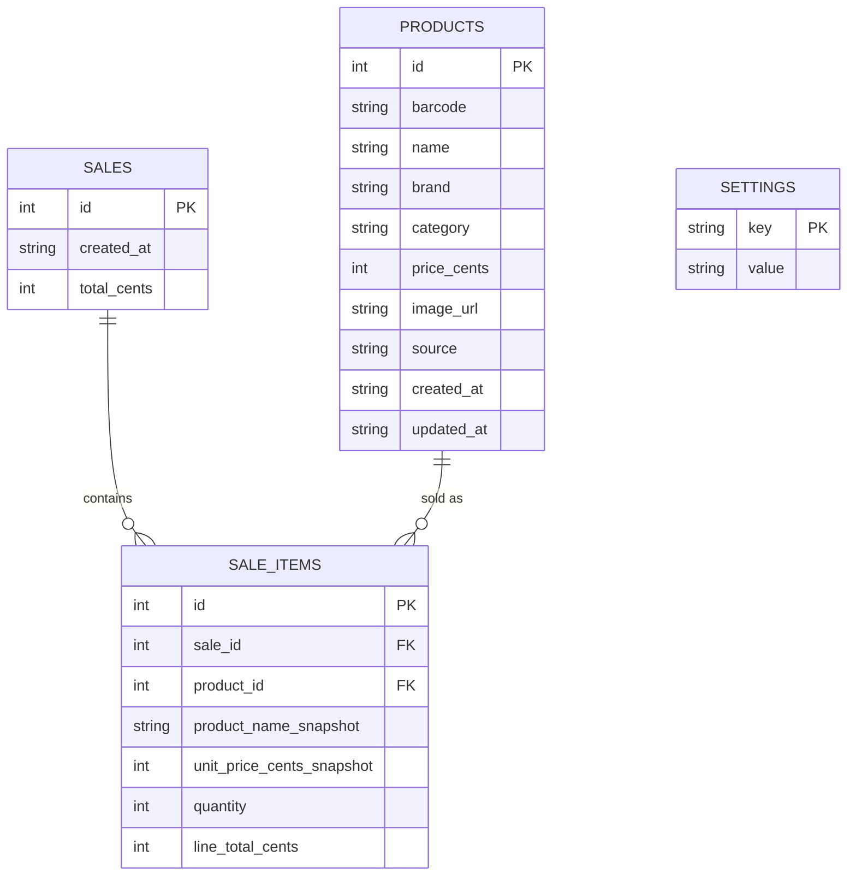
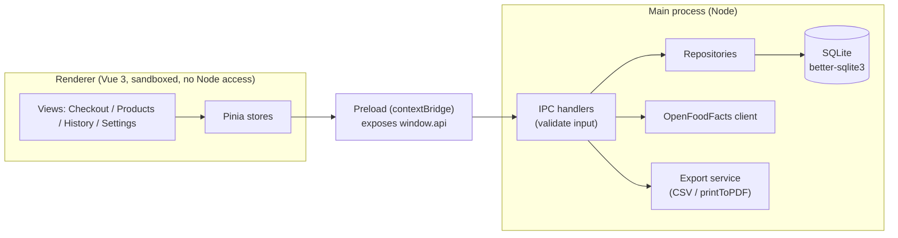

# Design Document — Grocery POS

## Context

A neighborhood grocery store currently runs on paper records and an old cash register. The owner needs a simple, offline-capable desktop application that a non-technical person can install and run reliably on the till PC. This document covers the data model, architecture, and the reasoning behind the technical choices left open by the brief.

## Data model

- **Prices are stored as integer cents**, not floats, to avoid rounding errors in totals.
- **`sale_items` snapshots the product name and price at the time of sale.** If a product's price or name changes later, past receipts and sales history must still reflect what the customer actually paid — this is the one place correctness matters most, so the join is deliberately denormalized.
- **`settings` is a single key/value table** for theme and language, instead of a second persistence mechanism (e.g. `electron-store`) alongside SQLite. One source of truth for local state.
- **`products.source`** (`manual` | `openfoodfacts`) records how a product entered the catalog, which drives the two distinct workflows the client's barcode requirement calls for.

## Architecture

- **Process boundary:** `contextIsolation: true`, `nodeIntegration: false`, `sandbox: true`. The renderer never touches Node or the database directly — only through `window.api`, exposed by the preload script via `contextBridge`. All channel names and request/response types are defined once in `src/shared/ipc-contract.ts` and imported by main, preload, and renderer, so the three sides cannot drift out of sync.
- **Validation lives in the main process**, at the IPC boundary (e.g. price must be a positive integer, a sale needs at least one item) — the renderer is treated as untrusted input, consistent with Electron's security guidance.
- **Repositories are factory functions** (`createProductsRepository(db)`, etc.) taking a `better-sqlite3` `Database` instance rather than a module-level singleton. This is what lets the test suite run the exact same logic against a `:memory:` database with no mocking.

## Key decisions

| Decision                                                                | Why                                                                                                                                                                                                                                                                       |
| ----------------------------------------------------------------------- | ------------------------------------------------------------------------------------------------------------------------------------------------------------------------------------------------------------------------------------------------------------------------- |
| SQLite (`better-sqlite3`) over a JSON file store                        | Relational queries (sales history, joins) and transactional writes; a JSON file risks corruption on a crash mid-write — and the client explicitly wants something that "doesn't crash."                                                                                   |
| Vue 3 + Pinia over React/Redux                                          | The brief mandates no specific UI framework; Vue's smaller footprint and built-in reactivity fit a form-and-table-heavy POS UI without much extra plumbing.                                                                                                               |
| Hash-based routing (`vue-router` + `createWebHashHistory`)              | The packaged app loads `index.html` via `file://`, where HTML5 history mode doesn't work without a server.                                                                                                                                                                |
| PDF receipts via `webContents.printToPDF`                               | Demonstrates a native Electron capability rather than reaching for a PDF library, directly relevant to the "Electron exploitation" grading criterion.                                                                                                                     |
| Barcode input via plain text field (USB scanner keyboard-wedge)         | Real USB barcode scanners type digits + Enter like a keyboard. This needs zero extra libraries and matches the client's "no technician needed" requirement; webcam scanning would add camera permission and decoding-library complexity for no real gain in this context. |
| `better-sqlite3` rebuilt per runtime (`pretest`/`posttest` npm scripts) | The native module's ABI must match whichever Node loads it: Electron's bundled Node for the app, the system Node for Vitest. Documented trade-off rather than a hidden footgun — see [README.md](./README.md#tests).                                                      |

## Offline-first behavior

All core operations (checkout, product CRUD, sales history) only ever touch the local SQLite database — there is no network dependency for any of the client's required features. The **only** network call in the app is the OpenFoodFacts barcode lookup, and it is designed to fail safely: a network error, timeout, or "not found" response all fall through to the same manual-entry form, and the cashier is notified via a system notification rather than a blocking error. The renderer also surfaces a live online/offline indicator (`navigator.onLine` + `online`/`offline` events) purely as a status cue.

## Security

- Sandboxed, context-isolated renderer with no Node integration.
- `Content-Security-Policy` restricts script/style to `'self'` and images to `'self'`, `data:`, and the OpenFoodFacts image CDN.
- All IPC inputs are validated server-side (main process) before reaching the database.
- `window.confirm` is used for destructive actions (deleting a product) — a deliberately simple choice for a single-operator till; a custom modal would add UI complexity without a real safety benefit at this scale.

## Known scope boundaries

The eight optional advanced modules from the brief (bulk import, loyalty, dashboard analytics, order delivery, printable receipts beyond the PDF export, backup/restore, auto-update, multi-station sync) are not implemented — the core 13-point requirement set was prioritized first, per an explicit decision with the project owner.
