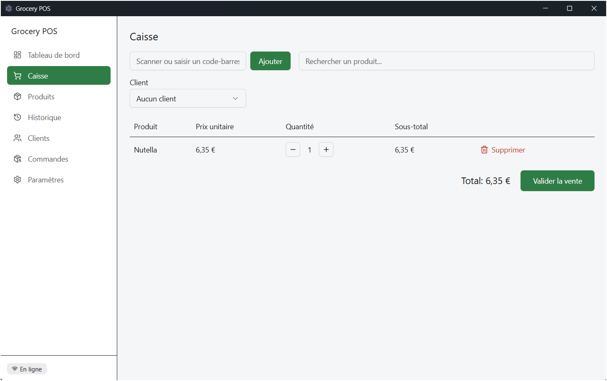
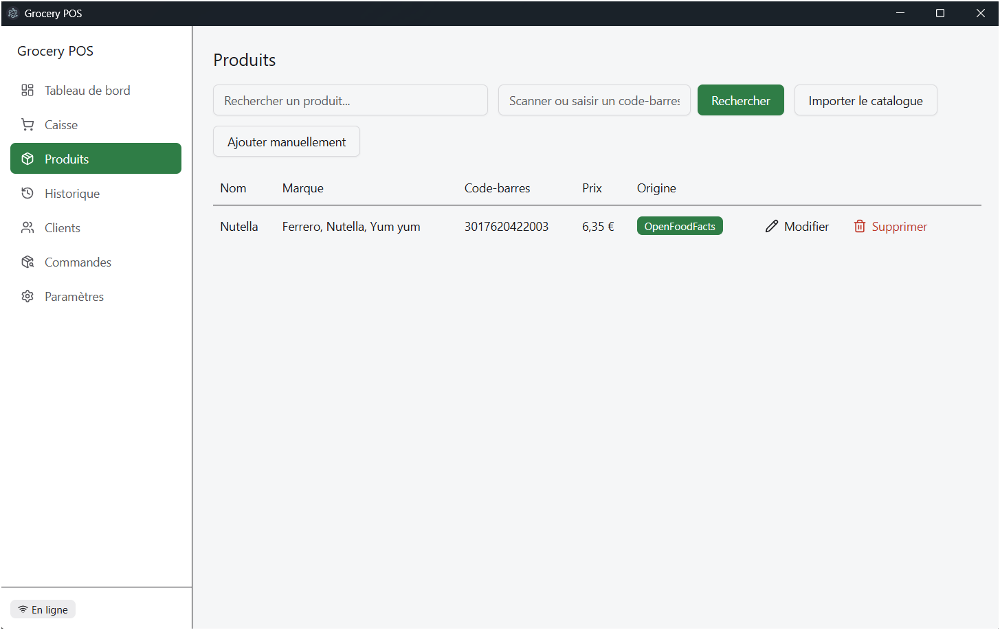
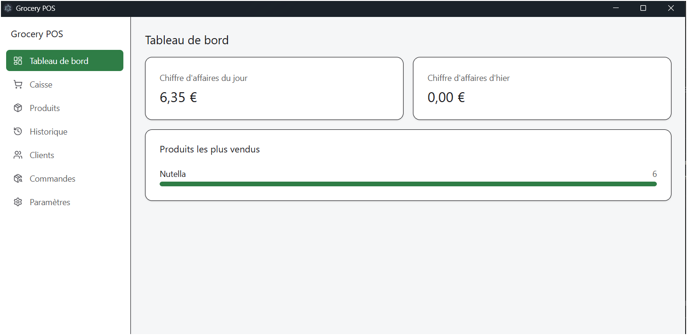
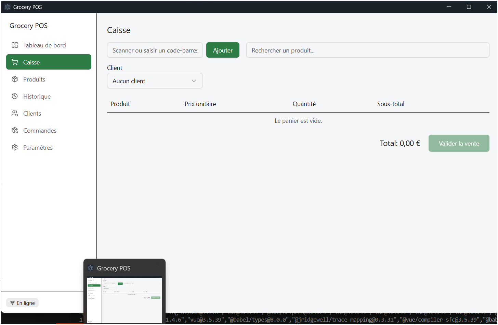

# Grocery POS

Une application de bureau de point de vente pour une épicerie de quartier, développée avec Electron, Vue 3 et TypeScript. Projet final pour le cours Electron de ic-etagsolutions.com.

Voir [DESIGN.md](./DESIGN.md) pour le modèle de données, l'architecture, et la justification des choix techniques.

## Fonctionnalités

- Catalogue de produits : ajout/modification/suppression, recherche par nom ou code-barres, import en masse depuis un CSV
- Recherche de code-barres auprès d'[OpenFoodFacts](https://world.openfoodfacts.org) pour les produits connus (la caissière confirme le prix), avec une saisie manuelle de repli pour les codes-barres inconnus ou en cas de déconnexion
- Caisse : scan/recherche pour constituer un panier, quantités, totaux, validation de la vente, et un client fidélité optionnel avec remise en points
- Historique des ventes (filtrable par période et par client) avec reçu par vente, imprimable ou exportable en PDF
- Tableau de bord avec le chiffre d'affaires du jour et d'hier, et les produits les plus vendus
- Programme de fidélité client : points gagnés et échangés en caisse
- Suivi de livraison des commandes : création d'une commande, avancement de son statut, notification à la livraison
- Sauvegarde et restauration de la base de données, et vérification automatique des mises à jour (`electron-updater`)
- Synchronisation multi-poste sur le réseau local (hôte/client) pour les produits et les ventes
- Export CSV (ventes, catalogue produits) et export PDF (reçus)
- Interface français/anglais et thème clair/sombre, tous deux persistés
- Entièrement utilisable hors ligne pour toutes les opérations essentielles — seules la recherche de code-barres, la vérification des mises à jour et la synchronisation nécessitent le réseau, et toutes trois sont conçues pour échouer sans danger
- Notifications système à la validation d'une vente, en cas d'échec de recherche, à la livraison d'une commande, et lorsqu'une mise à jour est disponible
- Packagée sous forme d'installeur Windows (NSIS)

## Prérequis

- Node.js 22+
- Windows (cible de l'installeur ; `npm run dev` fonctionne aussi sous macOS/Linux en développement)

## Installation

```bash
npm install
```

## Développement

```bash
npm run dev
```

## Tests

```bash
npm test
```

Lance la suite Vitest (logique des dépôts contre une base SQLite en mémoire, calculs du panier, formatage CSV, mapping des réponses OpenFoodFacts). Le module natif `better-sqlite3` est compilé pour l'ABI Node d'Electron en usage normal ; `npm test` le recompile automatiquement pour l'ABI du Node système, puis restaure le build Electron ensuite.

## Construire un installeur Windows

```bash
npm run build:win
```

Produit `release/grocery-pos-<version>-setup.exe` (installeur NSIS) ainsi qu'un build non packagé sous `release/win-unpacked/`.

## Captures d'écran

### Vue Caisse — panier et totaux



### Vue Produits — parcours de recherche OpenFoodFacts



### Tableau de bord — chiffre d'affaires et produits les plus vendus



### Application installée et lancée (preuve du packaging)


